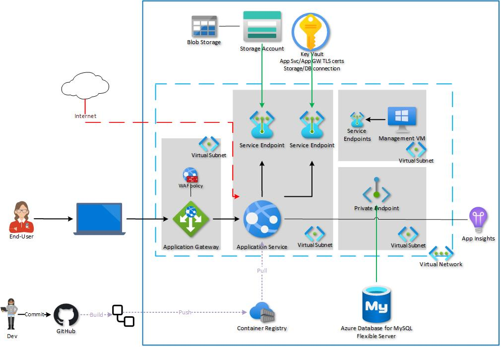

# Containerize Craft CMS on Azure App Service

> **NOTE:** This architecture diagram is not 100% representative of what the included Bicep templates deploy. Specifically:
>
> - the Bicep templates do not deploy the management VM (but the service endpoints are created in the `default` subnet)
> - the Bicep templates do not deploy an Application Gateway

